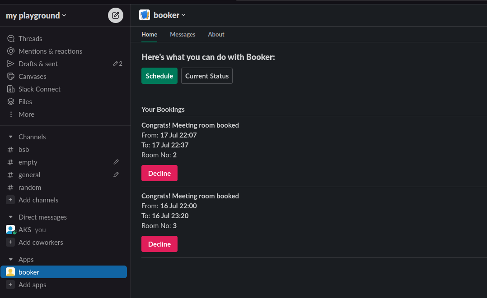

# Booker - A meeting room booking solution

### Features

- App Home

  - Actions ( Schedule and Current Status)
  - Decline booked meetings

  
- Schedule

  - Book meeting room in advance for your upcoming meetings
  - Avoid last minute hassle of going to each meeting room to check availability

  
- Current Status

  - for immediate booking check if any meeting room is empty with a click of a button
  - Decline booked meetings

  

# Slack Meeting Room Booking BOT

This is a Slack BOT that allows users to book meeting rooms and check current status of all the meeting rooms using the App home page. The BOT is built using Slack's socket mode implementation, which enables real-time communication between the BOT and Slack.

## Features

- **Meeting Room Booking**: Users can easily book available meeting rooms through the App home Slack interface. The BOT will check the availability of rooms and assist users in reserving a suitable room for their meeting.
- **Meeting Room Status**: Users can check the current status of all meeting rooms in the office. This feature provides visibility into room availability, allowing users to make informed decisions when scheduling meetings.

## Installation

To set up the Slack Meeting Room Booking BOT, follow these steps:

1. Clone the repository:
2. Install the project dependencies:

   ```
   go mod install
   go mod tidy
   ```
3. Create a new Slack App in your Slack workspace. You can follow the [Slack API documentation](https://api.slack.com/authentication/basics) to set up a basic Slack App.
4. Enable Socket Mode for your Slack App. Socket Mode allows real-time communication between the BOT and Slack. Refer to the [Slack API documentation](https://api.slack.com/apis/connections/socket) for more details on how to enable and configure Socket Mode.
5. Obtain the necessary credentials (tokens, keys, etc.) for your Slack App. These credentials will be required to authenticate and authorize the BOT's access to your Slack workspace. Make sure to securely store these credentials.
6. Configure the BOT:

   - Create a `.env` file in the project's root directory.
   - Set the following environment variables in the `.env` file:

     ```
     SLACK_APP_TOKEN=<your-slack-app-token>
     SLACK_BOT_TOKEN=<your-slack-bot-token>
     ```
   - Replace `<your-slack-app-token>` and `<your-slack-bot-token>` with the actual tokens obtained in the previous step.
7. Start the BOT:

   ```
   go run main.go
   ```
8. Invite the BOT to the desired channels in your Slack workspace, granting it the necessary permissions to interact with users and manage meeting room bookings.

## Usage

Once the BOT is up and running, users in your Slack workspace can start interacting with it. The following commands are available:

- App Home > click on schedule : Books the specified meeting room for the given time slot. The BOT will check availability and confirm the booking if the room is free.
- App Home > Current Status: Displays the current status of all meeting rooms in the office. Users can quickly check which rooms are available or occupied.

## License

This project is licensed under the [MIT License](LICENSE).

## Acknowledgments

- [Slack API Documentation](https://api.slack.com/)
- [Socket Mode Documentation](https://api.slack.com/apis/)
